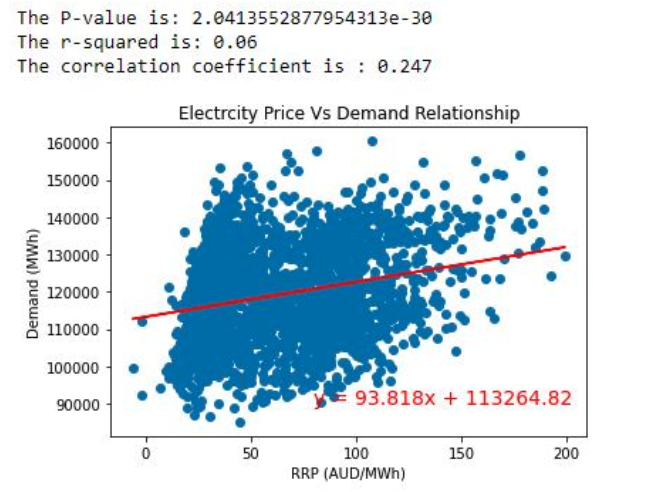
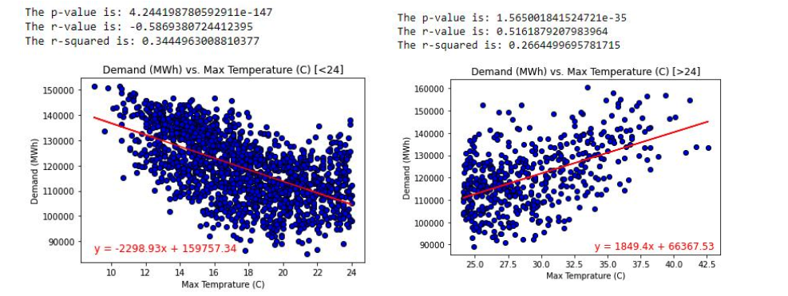
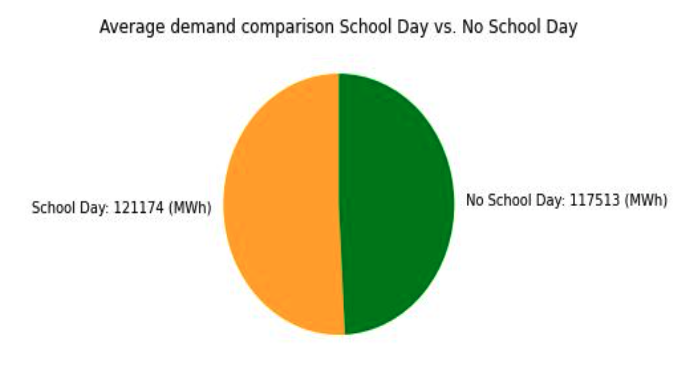
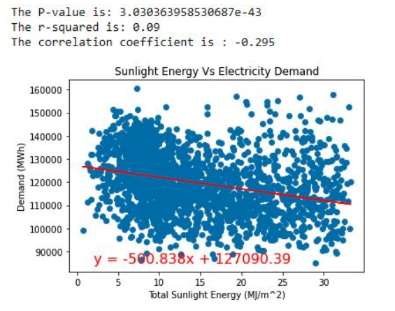
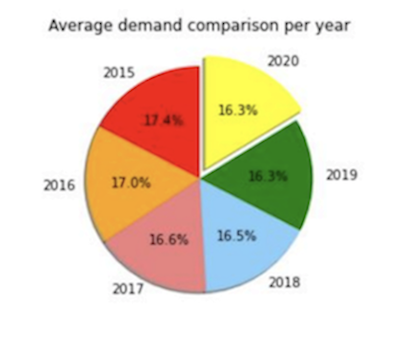

# Project 1: How different factors affect electricity demand and price.

As of 2020, 6.7 million people reside in Victoria, Australia's second most populated state. Most of them, 5 million, live or work in Melbourne, the state's capital. The dataset covers 2016 days between 1 January 2015 and 6 October 2020. The primary purpose of this project is to study energy consumption and how different factors affect demand and price.

# Project structure
```
Project-1
|__ Resources/              # contains answer images
|   |__ answer1.png         # image answer 1
|   |__ answer2.png         # image answer 2
|   |__ answer3.png         # image answer 3
|   |__ answer4.png         # image answer 4
|   |__ answer5.png         # image answer 5
|
|__ Resources/               # contains raw data
|   |__ complete_dataset.csv         # raw data
|
|__ .gitignore          # gitignore file
|
|__ electricity.ipynb  # analysis notebook that contains the data for analysis and charts 
|
|__ README.md     # Project description

```
# Usage

Activate environment 
```
# activate environment
conda activate PythonData
```

# Questions 

1. Is electricity demand correlated with price?
2. How does minimum and maximum temperature affect demand for electricity?
3. Do school days impact electricity demand? 
4. Does higher solar exposure cause electricity demand and price to be lower?
5. From 2020 onwards at the start of the pandemic, did increased working from home cause electricity demand and prices to increase?

# Datasets 

|No|Source|Link|
|-|-|-|
|1|Kaggle Open Source Datasets|https://www.kaggle.com/datasets/aramacus/electricity-demand-in-victoria-australia|

# Analysis

### Question 1: Is electricity demand correlated with price? 



We can say that electricity demand and price present a statistically significant but low positive correlation. Electricity demand is price inelastic, meaning it does not respond much to changes in price.
This leaves room for other factors that explain what influences consumers to change their electricity consumption.

### Question 2: How does minimum and maximum temperature affect demand for electricity? 



To answer this question, we made two scatter plots, one for maximum temperatures above and equal to 24 degrees celsius and another below this temperature. The typical comfortable room temperature range can be between 18-24 degrees celsius. 
Moving from 10 to 24 decreases demand, and 24 to 42 increases demand as people turn off and on their appliances in response to temperature.

### Question 3: Do school days impact electricity demand? 



We observe not any significant difference between school days and no school days. While kids not being in the house consuming electricity on school days decreases demand, the school days are aligned with business days which are likely to use more electricity.

### Question 4: Does higher solar exposure cause electricity demand and price to be lower? 



As we move towards renewable energy, many households meet their electricity needs through solar energy without drawing from the grid. When there is more sunlight energy in a day, people with solar panels demand less electricity.
The correlation is moderate, but as solar panel uptake increases and a higher proportion of electricity usage is solar energy, this relationship will likely get stronger.
In 2015 solar panels were not common in Victoria. By 2020 approximately 20% of households had solar panels. It is estimated that by 2030 50% of households will have solar panels. 
We can expect that as the uptake of solar panels increases, the difference in electricity demand between high and low sunlight days will increase.

### Question 5: From 2020 onwards at the start of the pandemic, did increased working from home cause electricity demand and prices to increase? 



The demand is very similar yearly from 2015 to 2020, even with Covid in 2020. Each year has similar peaks during the winter months (June - August). Some very brief spikes in the summer months are likely on the occurrence of very hot days close to 40 degrees Celsius. The average demand each year from 2015 to 2020 is very similar. 
We can conclude that Covid did not impact the average electricity consumption in 2020, even with the significant lifestyle changes from working from home. Residents increase their demand for electricity at home, but businesses can decrease their demand since offices are closed.

# Contributors
- [@AThompson7](https://github.com/AThompson7)
- [@sodacarlos](https://github.com/sodacarlos)
